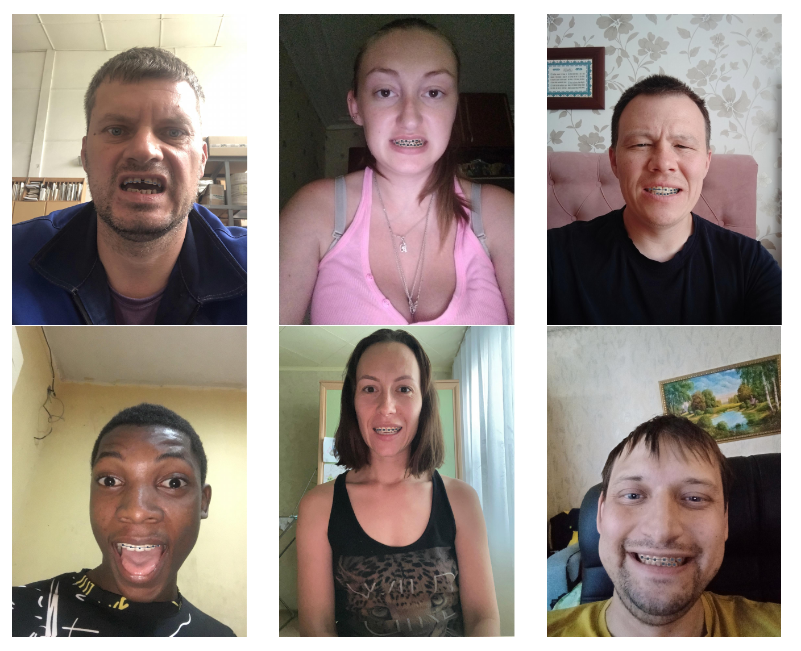
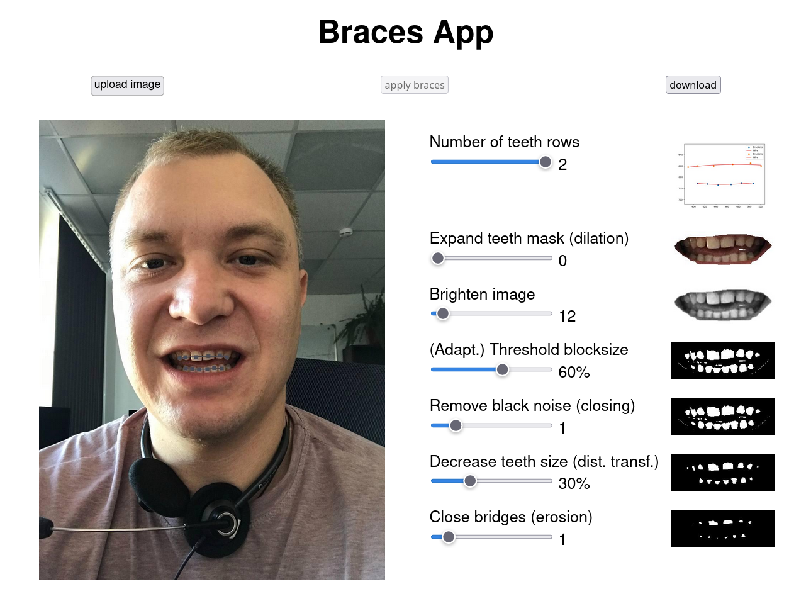

# Braces – Orthodontic Simulation Tool 🦷

Braces is a prototype application for simulating orthodontic braces placement 
using image segmentation models. The tool includes the full pipeline for 
training a U-net on the segmentation task, basic web UI and core backend.



## Features
- Image upload and preview via web interface
- Tooth segmentation using trained model
- Simulation of braces placement, adjustable via web interface
- Basic data visualization and debugging tools

## Project Structure
- `core/` – Backend logic: dataset tools, model training and inference for 
  segmentation task, simulation of braces
- `minimal_test_data/perfect_teeth_dataset/` – Sample data for testing
- `trained_models/` – (Not included) Pretrained models, see below
- `ui/` – Frontend (runs on Flask + HTML/CSS)
- `run.py` – Application entry point
- `braces-bericht-nellie.pdf` – (German) Project documentation

## Getting Started

### 1. Clone the Repository, install Requirements
```bash
git clone https://github.com/nreic/braces.git
cd braces
pip install -r requirements.txt
```

### 2. (Optional) Add Pretrained Model
Due to licensing restrictions and storage limitations, this repository does 
not include a pre-trained model. To experience the full functionality of 
this  project, you will need to train a model first using the provided 
training pipeline. Detailed instructions for model training can be found 
in the project report or by examining the implementation in `core/train.
py`. Once training is complete, all features will be available for use. 

### 3. Run the Application
```bash
python run.py
```

Open your browser at http://127.0.0.1:8000/ and upload a test image from 
`minimal_test_data/perfect_teeth_dataset` or your own picture. Check out the 
braces creation and adjust by setting the individual values of the image 
manipulation pipeline.



## Testing Specific Features

Run the following scripts individually to see the corresponding output:

- `core/dataset.py` – Loads and displays example data + transforms
- `core/model_inference.py` – Requires pretrained model
- `core/segmentation.py` – Runs segmentation with ground truth
- `core/orthodontist.py` – End-to-end prediction, 
segmentation, and simulation. Requires pretrained model

– see also braces-bericht-nellie.pdf for project context

## Dataset origin

The original dataset _Easy Portrait - Face Parsing and Portrait Segmentation 
Dataset_ was created by Kapitanov et al. and provided under a [Creative 
Commons](https://creativecommons.org/licenses/by-sa/4.0/) licence. Check out their [GitHub repo](https://github.com/hukenovs/easyportrait).  
